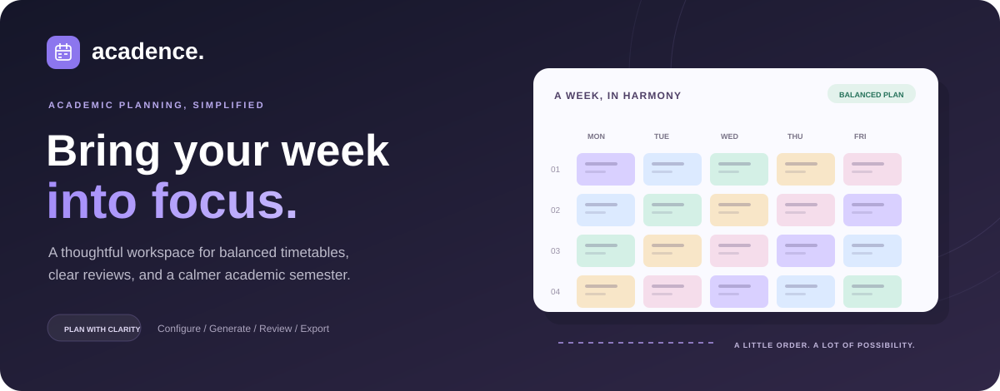
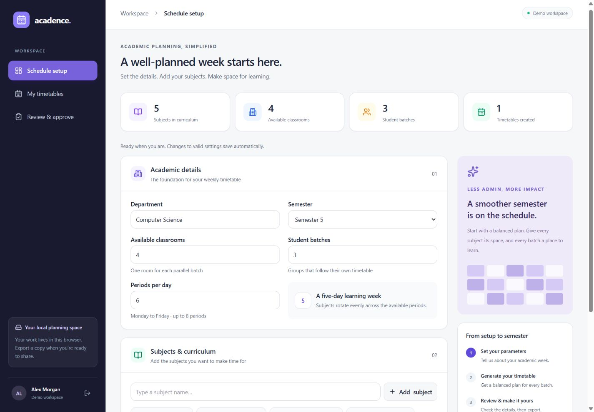
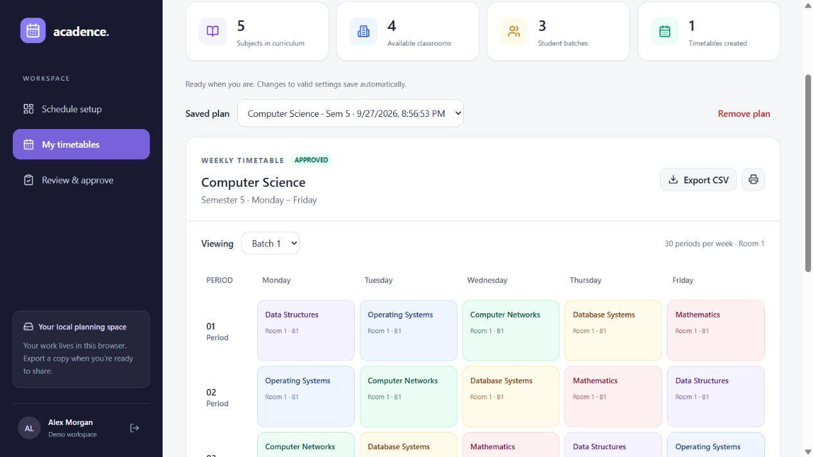
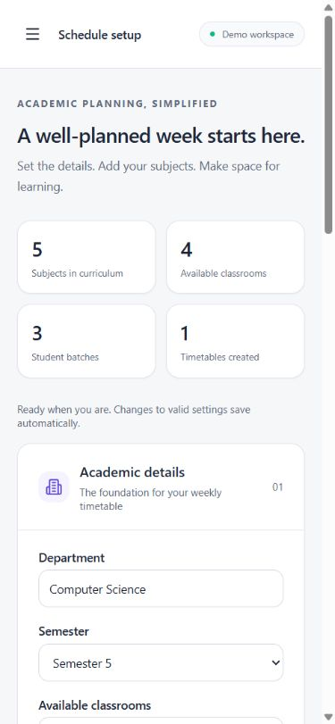
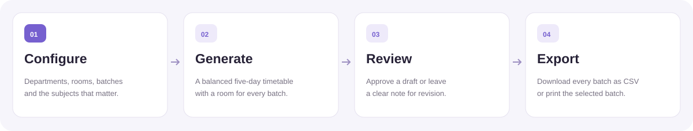
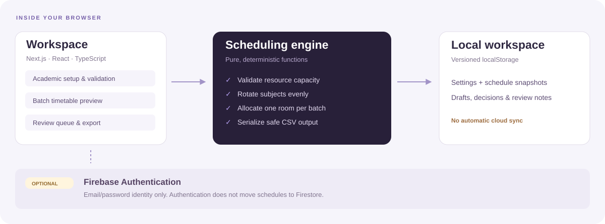

<div align="center">



# Acadence

### A little structure. A better academic week.

Plan your curriculum, generate balanced timetables, and review every detail<br />
in a thoughtfully designed academic workspace.

**Local-first planning · Responsive interface · Optional Firebase sign-in**

[Get started](#quick-start) &nbsp;·&nbsp;
[Explore the interface](#a-look-inside) &nbsp;·&nbsp;
[See how it works](#how-it-works) &nbsp;·&nbsp;
[Developer guide](#development) &nbsp;·&nbsp;
[Deployment](#deployment)


</div>

---

## Why Acadence?

Academic planning brings a lot of moving parts together. Acadence gives departments a clear place to organize subjects, allocate classrooms, and turn a set of parameters into a readable weekly plan.

Start with an example or your own curriculum. Generate a timetable for every batch. Review it, record revisions, and export a copy when it is ready.

| Plan with clarity                                               | Make every period count                                         | Keep the details in view                                   |
| :-------------------------------------------------------------- | :-------------------------------------------------------------- | :--------------------------------------------------------- |
| A guided setup for departments, semesters, rooms, and subjects. | Deterministic subject rotation across a five-day learning week. | Color-coded batch previews, review notes, and CSV exports. |

> **Current product scope:** Acadence is a working browser-local planning application. The scheduler balances subjects and prevents room/batch collisions **within each timetable**. Faculty scheduling, cross-timetable resource coordination, and cloud synchronization are future extensions.

## A look inside

**One organized workspace, from the first parameter to the final review.**



<details>
<summary><strong>View the timetable and mobile interface</strong></summary>
<br />

### A readable week for every batch

Switch between batches, inspect room allocations, and export all batches together.



### Designed for smaller screens, too

The sidebar becomes a keyboard-accessible menu. Setup fields stack vertically, and wide timetables scroll inside their own region.

<p align="center">
  
</p>

</details>

<sub>Screenshots show the real application with sample Computer Science data. The banner is an illustration. All visual assets are stored in this repository.</sub>

## Quick start

**Requirements:** Node.js **22.6+** and npm. The repository's `.nvmrc` selects Node 22.

From the project directory:

```sh
npm ci
npm run dev
```

Open **[localhost:3000](http://localhost:3000)** and select **Explore demo workspace**.

You can use the complete local planning flow without environment variables, an account, or a database. The initial example includes five subjects, four rooms, three batches, and six periods per day.

| Want to…                    | Start here                                                  |
| :-------------------------- | :---------------------------------------------------------- |
| Try the product immediately | Choose **Explore demo workspace**                           |
| Plan your own semester      | Replace the example in **Schedule setup**                   |
| Enable account sign-in      | Follow [Firebase configuration](#optional-firebase-sign-in) |
| Run a production build      | See [deployment](#deployment)                               |

## How it works



1. **Configure.** Choose your department and semester, then enter room, batch, and daily period counts.
2. **Build your curriculum.** Add subjects with the **Add subject** button or Enter. Duplicate names are rejected without regard to case.
3. **Generate.** Create a five-day plan, then choose a batch to inspect its lessons and room.
4. **Review.** Approve the draft or request revision with a required note. Generate a new draft after changing setup to create a revised version.
5. **Export.** Download a CSV containing all batches, or print the batch currently displayed.

Valid setup changes save automatically. Each generated plan keeps its own parameter snapshot, so later setup edits do not rewrite older timetables. **Load example** replaces setup fields while preserving saved plans.

### Included features

| Area                   | Implemented behavior                                                                                |
| :--------------------- | :-------------------------------------------------------------------------------------------------- |
| **Planning workspace** | Responsive sidebar, overview cards, guided setup, subject management, and empty states              |
| **Scheduling**         | Five-day deterministic generation, balanced subject counts, dedicated rooms per batch               |
| **Timetable view**     | Color-coded subjects, batch switching, saved-plan selection, accessible table headings              |
| **Review flow**        | Draft/approved/rejected labels, status filtering, review comments, required revision reasons        |
| **Portability**        | CSV for all batches, print action for the visible batch, confirmation before plan removal           |
| **Persistence**        | Versioned browser storage, workspace keys scoped to identity, up to 20 saved plans                  |
| **Authentication**     | Optional Firebase email/password sign-in and registration; explicit demo entry                      |
| **Accessibility**      | Form labels, focus indicators, live status/error messages, mobile focus trapping and Escape support |

## Scheduling model

The engine assigns a dedicated room to every batch and rotates the subject list through the available periods.

```text
weekly periods per batch = 5 × periods per day
total lessons            = weekly periods per batch × batches

subject index = (day × periods per day + period + batch) mod subject count
room          = batch + 1
```

Day, period, and batch indices are zero-based. Rotating each batch's starting subject distributes lessons across the week. For each batch, weekly subject counts differ by **at most one lesson**.

**Example:** 3 batches × 6 periods × 5 days = **90 lessons**. With 5 subjects, each subject receives **6 lessons per batch**.

<details>
<summary><strong>Validation rules and capacity limits</strong></summary>

| Parameter            | Accepted input                                        |
| :------------------- | :---------------------------------------------------- |
| Department           | 1–80 characters after trimming                        |
| Semester             | 1–12                                                  |
| Available classrooms | 1–50 whole rooms                                      |
| Student batches      | 1–50 whole batches; no more than available classrooms |
| Periods per day      | 1–8 whole periods                                     |
| Subjects             | 1–40 unique names, each 1–60 characters               |
| Subject coverage     | No more subjects than available weekly periods        |
| Saved timetables     | Up to 20 per workspace                                |
| Review note          | Up to 500 characters; required for revision           |

Empty fields, fractional counts, non-finite values, duplicate subjects, insufficient rooms, and impossible weekly coverage are rejected. Unsaved text in the subject input must be added or cleared before generation.

</details>

### What the engine does not model yet

- Faculty availability or faculty conflicts.
- Subject-specific contact hours, consecutive laboratory periods, or equipment requirements.
- Clock times, breaks, holidays, or alternative working weeks.
- Room and resource collisions between separate saved timetables.
- Institutional publishing, notifications, or enforced administrator approval.

Period numbers describe sequence, not clock times. Reviews are personal planning decisions stored locally; approval does not publish a timetable.

## Architecture



| Layer                                        | Responsibility                                                            |
| :------------------------------------------- | :------------------------------------------------------------------------ |
| **Next.js App Router + React**               | Application entry, authentication context, and workspace UI               |
| **TypeScript scheduling functions**          | Input validation, allocation, saved-record checks, safe CSV serialization |
| **Tailwind CSS + Lucide**                    | Design tokens, responsive layouts, icons, and print styling               |
| **Browser localStorage**                     | Setup, schedule snapshots, statuses, and review notes                     |
| **Firebase Authentication — optional**       | Email/password identity and session restoration                           |
| **Node's test runner + ESLint + TypeScript** | Regression coverage, linting, and static validation                       |

The active frontend does not call the legacy Express server or require Firestore/Supabase.

## Data and persistence

**Your workspace stays in the current browser profile.**

- Saved data uses a versioned `localStorage` key, scoped to the Firebase user ID or the shared demo identity.
- Signing out retains locally saved plans. Signing in elsewhere does **not** synchronize them.
- Demo data is shared by anyone using the same browser profile.
- Browser storage is neither encrypted nor a server authorization boundary. Do not store sensitive student records.
- If storage is unavailable or full, the app keeps changes in memory and explains that saving failed.
- Corrupt or incompatible saved data produces a warning. A subsequent valid save replaces the unreadable workspace data.
- Incomplete setup edits do not prevent review decisions from being saved; the last valid setup is retained.
- CSV cells are quoted, and formula-like values are neutralized before export.

**Export a copy before clearing browser data, removing a plan, or moving to another device.** CSV import is not currently implemented.

## Optional Firebase sign-in

Demo mode works without Firebase. To enable accounts:

1. Create a Firebase project and register a web app.
2. Enable **Authentication → Email/Password**.
3. Copy [`.env.example`](.env.example) to `.env.local`.
4. Fill in all four public web-app settings:

   ```dotenv
   NEXT_PUBLIC_FIREBASE_API_KEY=your-firebase-api-key
   NEXT_PUBLIC_FIREBASE_AUTH_DOMAIN=your-project.firebaseapp.com
   NEXT_PUBLIC_FIREBASE_PROJECT_ID=your-project-id
   NEXT_PUBLIC_FIREBASE_APP_ID=your-firebase-app-id
   ```

5. Add your deployment hostname to Firebase Authentication's authorized domains.
6. Restart the dev server or rebuild the deployed app.

The UI uses Firebase for authentication only. It does not require Firestore profile documents and does not grant administrator privileges through registration. Never put service-account credentials into `NEXT_PUBLIC_*` variables.

Missing configuration keeps demo mode available while disabling account sign-in. Invalid credentials, rate limits, network errors, session loading, and failed sign-out attempts have explicit UI states.

## Development

| Command                                   | Purpose                                                      |
| :---------------------------------------- | :----------------------------------------------------------- |
| `npm run dev`                             | Start the local development server                           |
| `npm run lint`                            | Check source with the Next.js ESLint configuration           |
| `npm run typecheck`                       | Run TypeScript without emitting files                        |
| `npm test`                                | Run the scheduling, export, and retired-API regression tests |
| `npm run format`                          | Format application source and README with Prettier           |
| `npm run build`                           | Build for production with lint/type validation enabled       |
| `npm start`                               | Serve the production build                                   |
| `node scripts/generate-readme-assets.mjs` | Regenerate the README's editable SVG graphics                |

Use npm and the committed `package-lock.json` to keep installations consistent.

### Quality checks

**8 regression tests** cover invalid input, case-insensitive duplicates, capacity limits, deterministic allocation, collision prevention, balanced subject coverage, boundary sizes, malformed saved schedules, safe CSV output, and fail-closed behavior of the retired API.

Browser checks cover the demo flow, validation errors, batch switching, review notes, approval persistence after reload, responsive layouts, mobile menu keyboard handling, and CSV download.

Run the checks before submitting a change:

```sh
npm run lint
npm run typecheck
npm test
npm run build
```

<details>
<summary><strong>Project structure</strong></summary>

```text
app/
  AuthContext.tsx             Firebase sessions and explicit demo mode
  page.tsx                    Login/workspace entry
  globals.css                 Design tokens, accessibility, print styles
components/
  dashboard.tsx               Navigation, local persistence, plan lifecycle
  login-form.tsx              Sign-in, registration, demo entry
  parameter-form.tsx          Academic setup and subject validation
  timetable-generator.tsx     Batch previews, CSV export, printing
  review-workflow.tsx         Review queue and comments
lib/
  scheduler.ts               Pure validation, allocation, and export
  firebaseClient.ts          Optional Firebase initialization
tests/
  scheduler.test.mjs          Scheduling and CSV regression tests
  legacy-api.test.mjs         Rejection of writes to the retired endpoint
public/readme/
  *.svg                      Original banner, stack, workflow, architecture
  *.png                      Screenshots of the running application
scripts/
  generate-readme-assets.mjs  Dependency-free SVG asset generator
```

</details>

## Deployment

Use Node 22 and a host that supports Next.js.

```sh
npm ci
npm run build
npm start
```

The included [Netlify configuration](netlify.toml) uses the Next.js plugin with `.next` as its build output. It does not use an SPA rewrite to `/index.html`.

Set any Firebase public variables **before building**; Next.js includes them in the client bundle. Use HTTPS for deployed environments. Browser-local data remains specific to each browser and site origin after deployment.

<details>
<summary><strong>Troubleshooting</strong></summary>

| Symptom                              | What to check                                                                  |
| :----------------------------------- | :----------------------------------------------------------------------------- |
| Account sign-in is disabled          | Set all four Firebase values and restart/rebuild. Demo remains available.      |
| Email/password sign-in fails         | Enable the provider, check credentials, and authorize the deployment domain.   |
| Generation reports too few rooms     | All batches run in parallel; provide at least one room per batch.              |
| Subjects exceed weekly capacity      | Increase periods per day or reduce the subject list.                           |
| A subject is rejected as a duplicate | Names are compared without regard to case and surrounding whitespace.          |
| Changes cannot be saved              | Check browser storage restrictions or quota; export any plan you need to keep. |
| A new device has no schedules        | Plans are local. Firebase sign-in does not synchronize them.                   |
| The saved-plan limit is reached      | Export an older plan and remove it before generating another.                  |
| Tests cannot load TypeScript         | Use the Node version specified above; tests rely on type stripping.            |
| Production server cannot start       | Run `npm run build` first and ensure port 3000 is available.                   |

</details>

<details>
<summary><strong>Legacy integrations and historical documentation</strong></summary>

Supabase migrations, older setup/deployment notes, and the Firestore migration script remain as historical integration scaffolding. They do not enable cloud storage in the current application.

`npm run server` starts an optional Express process on **127.0.0.1:5000**. Its `GET /health` route responds, while `POST /api/timetables/select` returns **410 Gone**. The former selection prototype decoded tokens without verifying them and has been retired. The frontend does not depend on this process.

The migration script needs separate administrative credentials and writes to Firestore. Review it before running it. This README describes the implemented application and supersedes older roadmap claims.

</details>

## Future directions

These are **extension ideas**, not currently available features:

- Faculty availability, workload limits, and richer institutional constraints.
- Subject-specific weekly hours, lab blocks, and configurable working days.
- Shared persistence with server-side authorization and auditable reviews.
- Cross-timetable resource checks, publishing, and notifications.
- Importing saved plans and structured curriculum data.

## Contributing

Keep changes focused and include the reason for the change. Add regression coverage when scheduling behavior changes, run the quality checks, and update documentation when user-visible behavior changes. For interface changes, check both desktop and mobile layouts.

The documentation graphics are original, editable SVGs with no external fonts, scripts, or image services. The hero uses subtle CSS animation and respects reduced-motion preferences; renderers without animation show the same readable design. Regenerate graphics with the asset script after editing their source.

---

<div align="center">

**Acadence** · Thoughtfully built for academic planning.

[Back to top](#acadence)

</div>
